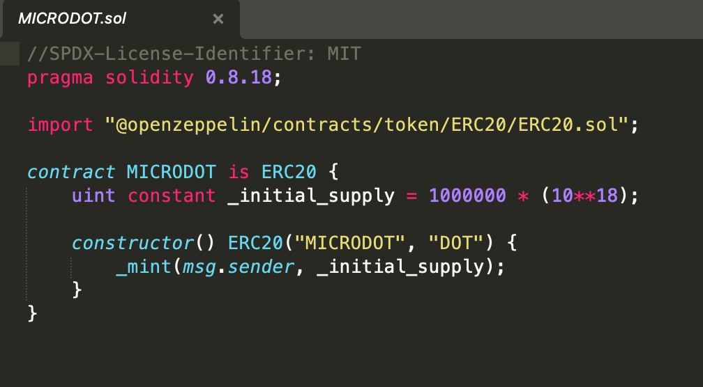

### About

Project Name: `ERC20` Smart Contract Development & Deployment

Skills: `Blockchain`, `Ethereum`, `ERC20`, `OpenZeppelin`, `Smart Contracts`, `Solidity`, `Hardhat`

### Preview:

### Overview:

ERC20 Token contract depvelopment and deployment using Hard hat and Ethers.js.

### Features:

- ERC20 Token contract depvelopment and deployment using `Hardhat` and `Ethers.js`.

- Inheritance implemented for `OpenZeppelin` ERC20 contract in solidity.

### Project Layout

1. `/contracts` : contains ERC20 token contract written in solidity.
2. `/scripts` : deployment & interaction scripts for the ERC20 token.
3. `hardhat.config.js` : configuration settings for deployment.
4. `package.json` : project dev dependencies.
